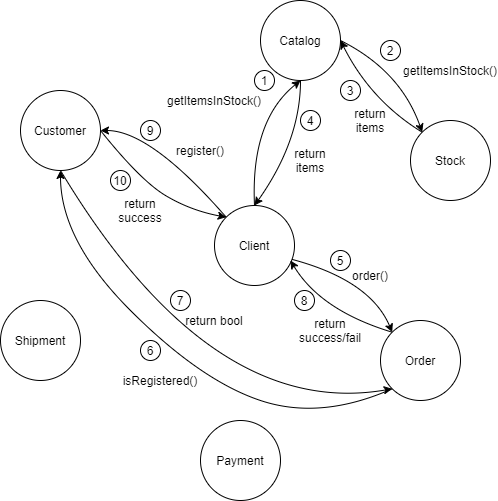
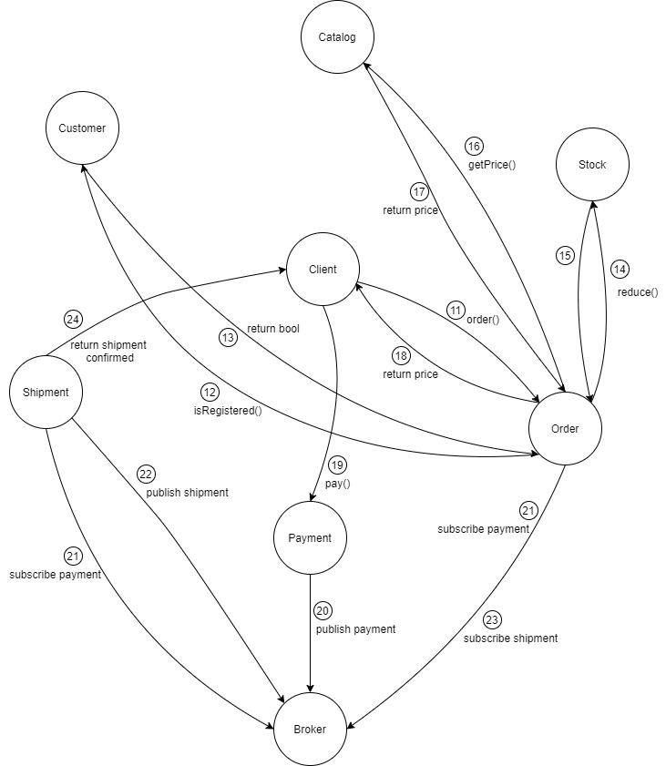

# Teilaufgabe 1

### Customer

*Daten:* customerID, name, address

*Funktionalität:*
* neuen Kunden anlegen
* Kunden finden
* Kunden löschen

*Kommunikation mit:* 
* Client (synchron)
* Shipment(synchron)

### Catalog

*Daten:* articleID, name, price 

*Funktionalität:* 
* Artikel hinzufügen
* einzelnen Artikel zurückgeben
* alle Artikel auflisten
* alle Artikel anzeigen, die im Bestand sind
* Artikel löschen

*Kommunikation mit:* 
* Client (synchron)
* Stock (synchron)
* Order (synchron)

### Stock

*Daten:* articleID, amount 

*Funktionalität:* 
* Artikel mit Bestand hinzufügen
* Bestand eines einzelnen Artikels zurückgeben
* Bestand eines Artikels erhöhen/reduzieren
* alle Artikel und Bestände auflisten

*Kommunikation mit:* 
* Client (synchron)
* Catalog (synchron)
* Order (synchron)

### Order 

*Daten:* orderID, customerID, Liste von articleID und dazugehörigen Mengen, isPayed (bool), isSent(bool)

*Funktionalität:* 
* Bestellung aufgeben
* defekte Artikel zurückschicken
* Bestellung stornieren (falls noch nicht versandt)

*Kommunikation mit:* 
* Client (synchron)
* Catalog (synchron)
* Stock (synchron)
* Payment (asynchron, Empfänger)
* Shipment (asynchron, Empänger)

### Payment

*Daten:* -

*Funktionalität:* 
* Bestellung bezahlen

*Kommunikation mit:* 
* Client (synchron)
* Shipment (asynchron, Sender)
* Order (asynchron, Sender)

### Shipment

*Daten:* -

*Funktionalität:* 
* Bestellung versenden

*Kommunikation mit:* 
* Client (synchron)
* Order (synchron)
* Customer (synchron)
* Order (asynchron, Sender)
* Payment (asynchron, Empfänger)

## Ablauf einer Bestellung eines nicht registrierten Kunden:

Der Client fragt zunächst alle Artikel ab, die auf Lager sind. Dazu wird eine Nachricht an den Catalog-Service geschickt. Da der Catalog-Service nicht weiß, welche Artikel auf Lager sind, muss er eine Nachricht an den Stock-Service schicken. Dieser Antwortet mit einer Auflistung aller Artikel, die auf Lager sind. Der Catalog-Service schickt die entsprechenden Artikel dann an den Client.
Der Client entscheidet sich dann einen der angezeigten Artikel zu bestellen und schickt eine Nachricht mit der articleID an den Order-Service. Da der Kunde noch nicht registriert wurde, wird auch keine customerID mitgeschickt. Also Antwortet der Order-Service zunächst mit dem Hinweis, sich beim Customer-Service zu registrieren.
Der Client schickt dann eine Nachricht an den Customer-Service mit seinem Namen und seiner Adresse. Dieser dann einen neuen Kunden mit dem entsprechenden Namen, der Adresse und einer neuen customerID an. Letztere wird in der Antwort an den Kunden mitgegeben.
Nach der Registrierung schickt der Client jetzt erneut seine Bestellung an den Order-Service und gibt dieses mal seine customerID mit. Der Order-Service versichert sich, dass es wirklich einen Kunden mir der übergebenen ID gibt. Danach schickt der Order-Service eine Nachricht an den Stock-Service mit der articleID und der Anzahl, um die der Bestand dieses Artikels reduziert werden soll.
Der Stock-Service reduziert dann den Bestand des entsprechenden Artikels.
Der Order-Service berechnet dann den Gesamtpreis der Bestellung und schickt diesen an den Client zurück mit der Aufforderung ihn beim Payment-Service zu bezahlen.
Der Client schickt dann eine Nachricht mit der orderID an den Payment-Service. Dies entspricht der Bezahlung. Der Payment-Service publisht dann, dass die Bestellung mit der orderID bezahlt ist.
Daraufhin setzt der Order-Service isPayed bei der entsprechenden Bestellung auf true.
Der Shipment-Service reagiert daraufhin ebenfalls. Er fragt die Artikel und die dazugehörigen Mengen vom Order-Service mit der orderID ab. Außerdem holt er sich die customerID der Bestellung und fragt damit den Namen und die Adresse des Kunden beim Customer-Service ab. Anschließend schickt er eine Versandbestätigung an den Kunden und publisht die orderID.
Daraufhin setzt der Order-Service isSent auf true.

Bild 1. Ablauf vor dem Registrieren

Bild 2. Ablauf nach dem Registrieren

